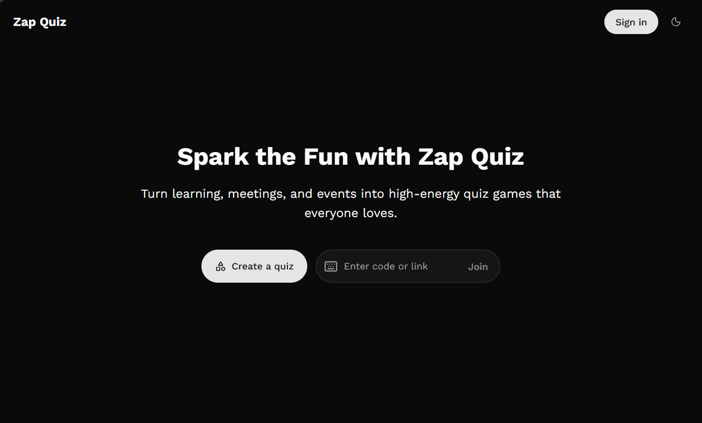

# Hey there! I'm Michael Jola-Moses

  

### I craft delightful digital experiences through clean code and design

Passionate about building user-centric applications that make a difference. I specialize in modern web technologies and love turning complex problems into simple, beautiful solutions.

[LinkedIn](https://www.linkedin.com/in/michael-jola-moses) | [Email](mailto:mikejolamoses@gmail.com)

&nbsp;

---

&nbsp;

## **My Projects** 🚀

### **Featured Projects**

  

**[Zap Quiz](https://zap-quiz-six.vercel.app/)** - _Modern Kahoot Alternative_

A well-designed, high-energy quiz platform that transforms learning, meetings, and events into engaging interactive experiences. Built with a modern tech stack and real-time capabilities, it provides a seamless quiz creation and participation experience.

**Key Features:**

- 🎮 Interactive real-time quiz games
- 📝 Easy quiz creation and management
- 👥 Multi-player support with live scoring
- ⚡ Real-time synchronization and updates
- 🎨 Modern, responsive UI/UX design
- 🔐 User authentication and session management
- 📊 Live leaderboards and analytics

**Tech Stack:** `NextJS` `TypeScript` `TailwindCSS` `NestJS` `WebSocket` `Postgres`

---

<!-- 

<table>
<tr>
<td width="33.33%">

**[Mezclar Outfits](https://mezclaroutfits.com)**

A comprehensive e-commerce solution built with modern web technologies, featuring user authentication, payment processing, and inventory management.

**Features:**

- 🔐 User authentication & authorization
- 💳 Secure payment processing
- 📱 Responsive design for all devices
- 🛒 Shopping cart & checkout flow
- 📊 Admin dashboard for inventory management

**Tech:** `NextJS` `TailwindCSS` `MongoDB` `AWS Lambda` `AWS API Gateway`

</td>
<td width="33.33%">

**[Spotlexx](https://spotlexx.vercel.app/)**

A clean and modern photography portfolio showcasing beautiful image galleries with smooth animations and responsive design.

**Features:**

- 📸 Image gallery with lightbox
- 🎨 Modern UI/UX design
- 📱 Fully responsive
- ⚡ Fast loading with NextJS

**Tech:** `NextJS` `TailwindCSS`

</td>
<td width="33.33%">

**[Ion Commerce](https://ion-commerce.vercel.app/)**

A mobile-first e-commerce application built with Ionic React, featuring native-like performance and seamless payment integration.

**Features:**

- 📱 Mobile-first design
- 💰 Integrated payment system
- 🛒 Shopping cart functionality
- 🔄 Real-time updates

**Tech:** `Ionic React` `TailwindCSS` `Paystack`

</td>
</tr>
</table> -->

&nbsp;

---

&nbsp;

## **My Stack** ⚡

            

&nbsp;
